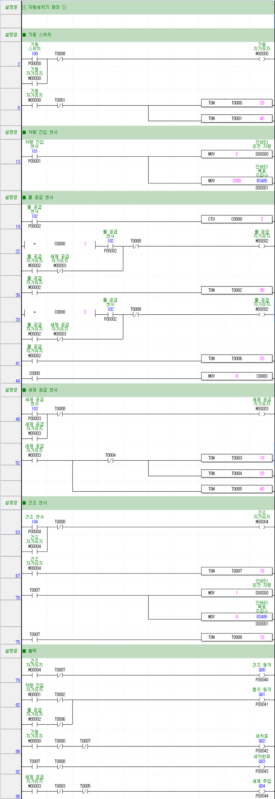

# PLC 제어기술자(3급) 시험문제
- 제 2과제 PLC 공정제어
- 제 3과제 PLC 공정제어(자동세차기 제어)

## 제 2과제 PLC 공정제어

---

## 제 3과제 PLC 공정제어(자동세차기 제어)

### 동작사항
1. 다음과 같이 인버터의 파라미터를 설정한다.
   - 운전그룹 설정 / 운전지령 : Int 485 / 주파수설정방법 : Int 485
2. 전원을 투입하면 세차완료(RL2)가 점등하고, 유도전동기는 2㎐로 역회전한다.
3. 기동 스위치(PB1)를 누르면 세차완료(RL2)가 소등하고, 유도전동기는 정지하며, 세차 중(YL1)이 2초 주기(1초 ON/ 1초 OFF)로 점멸한다.
4. 차량 진입 센서(PB2)를 누르면, 유도전동기는 20㎐로 정회전한다.
5. 차량이 특정 위치에 도착, 물 공급 센서(PB3)를 누르면, 물 공급을 위해 펌프 동작(GL1)이 점등하고, 유도전동기는 10㎐로 정회전한다.
6. 차량이 특정 위치에 도착, 세제 공급 센서(PB4)를 누르면, 펌프동작(GL1)은 소등하고, 세제 공급을 위해 세제 투입(GL2)이 3초 동안 점등하며, 소등할 때 유도전동기는 20㎐로 정회전한다.
7. 차량이 특정 위치에 도착, 물 공급 센서(PB3)를 누르면, 물 공급을 위해 펌프 동작(GL1)이 점등하고, 유도전동기는 10㎐로 정회전한다.
8. 차량이 특정 위치에 도착, 건조 센서(PB5)를 누르면 펌프 동작(GL1)이 소등하고, 누르는 동안에는 차량 건조를 위해 건조 동작(RL1)이 점등한다. 건조센서(PB5)가 꺼지면 건조동작(RL1)과 세차 중(YL1)이 소등하고, 세차완료(RL2)가 점등한다. 이때 유도전동기는 2㎐로 역회전한다.
9. 다시 기동 스위치(PB1)을 누르면 3~9 과정이 반복된다.
10. 진행 중 과전류가 흐르면, OCR이 동작하여 전동기는 정지한다.

### 타임차트
![[기동 ⇨ 차량 진입 ⇨ 물 공급 ⇨ 세제 공급]](example_03a.png)
![[물 공급 ⇨ 건조 ⇨ 세차 완료 ⇨ 재기동]](example_03b.png)

### 래더 다이어그램

