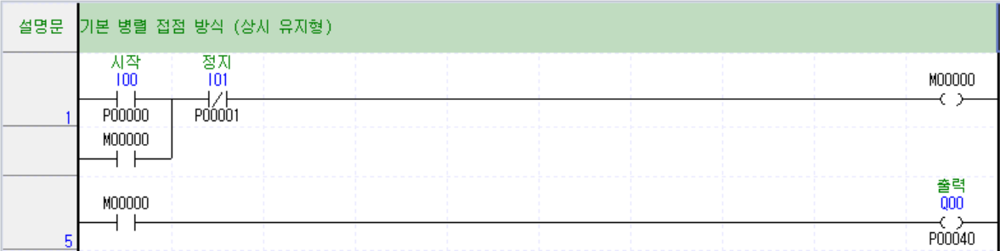
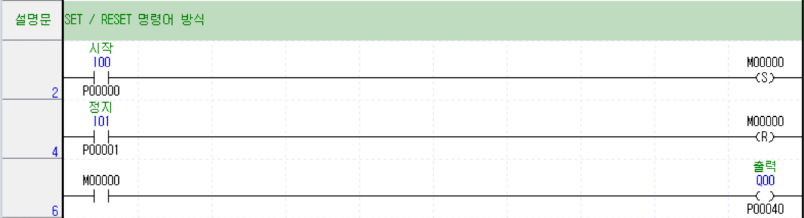

# 자기유지 구현 방법

## 1. 기본 병렬 접점 방식

- 활용
  - 단일 기기 제어 및 안전 중심 회로
  - 단발성 ON/OFF 제어 (모터, 램프, 밸브)
- 특징 
  - **비상 정지(Emergency) 또는 안전**이 최우선일 때 무조건 사용
  - PLC 전원이 순간적으로 끊겼다 켜지거나(순시 정전), 에러가 나서 리셋되면 **자기유지가 자동으로 풀려(OFF)** 기기가 멈추므로 안전

## 2. SET / RESET 명령어 방식

- 활용
  - 순차 공정 및 자동화 시퀀스 제어
  - 단계별 공정 제어 (자동 라인, 로봇, 실린더)
- 특징
  - **조건이 복잡한 공정 단계 전환** 
  - SET/RST는 시작 조건과 종료 조건을 다른 라인에 깔끔하게 분리할 수 있어 대규모 자동화에 유리
  - 정전이 되어도 **이전 작업 단계를 기억(Latch)**해야 할 때 