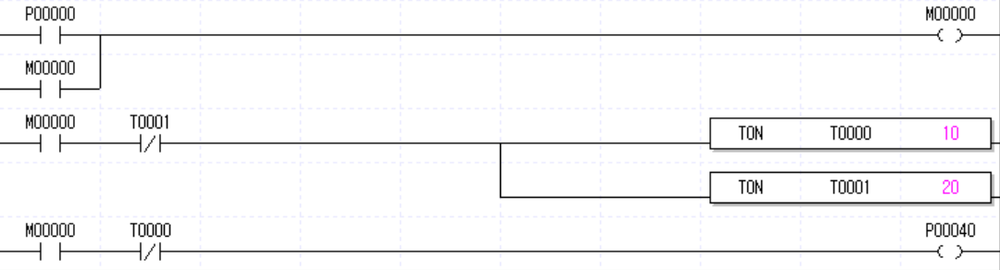
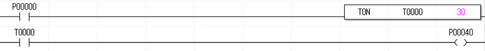
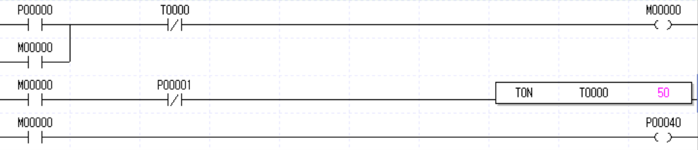

# ⏱️ 타이머

## 1. 종류
| 타이머 종류 | 입력 ON 시점 동작 | 입력 OFF 시점 동작 | 도중 입력 해제 시 | 특징 |
| :--- | :--- | :--- | :--- | :--- |
| TON | 시간 측정 시작 | **즉시 출력 OFF** | 시간 초기화됨 | 지연 제어 |
| TOFF | **즉시 출력 ON** | 시간 측정 시작 | (이미 OFF 상태임) | 잔여 가동, 사후 제어 |
| TMON | **즉시 출력 ON** | 무관 (시간 유지) | 시간 유지 및 자동 OFF | 1회성 펄스 출력 |
| TMR | 시간 측정 시작 | 시간 일시정지 (유지) | **시간 기억함** | 적산 타이머, 리셋 필수 |
| TRTG | **즉시 출력 ON** | 무관 (시간 연장) | 신호 재입력 시 시간 연장 | 연속 신호 감지, Jam 알람 |

---

## 2. 응용명령

- 형식: `TON T t`
    - T: 사용하고자 하는 타이머 접점
    - t: 타이머의 설정 시간 (기본 단위: 0.1s)
- 예시: `TON t0 10`

---

## 3. TON 예제

### 3-1. 플리커 (Flicker) 회로

- 푸시버튼(P0)을 누르면 '즉시 1초 동안 점등' 한 후, '1초 동안 소등'을 반복하는 회로 입니다.

### 3-2. 온딜레이 (On-Delay) 회로

- 푸시버튼(P0)을 정확히 3초 동안 꾹 누르고 있어야 오작동 방지 필터가 해제되며
모터(P40)가 기동합니다. 중간에 손을 떼면 타이머는 즉시 리셋됩니다.

### 3-3. 자기유지 기반 오프딜레이 (Off-Delay) 회로

- 푸시버튼(P0)을 누르면 즉시 냉각팬(P40)이 돕니다. 정지 버튼(P1)을 누르면 시스템은 정지하지만,
내부 열을 식히기 위해 5초간 후열(냉각)을 유지한 뒤 팬이 자동으로 꺼집니다.

