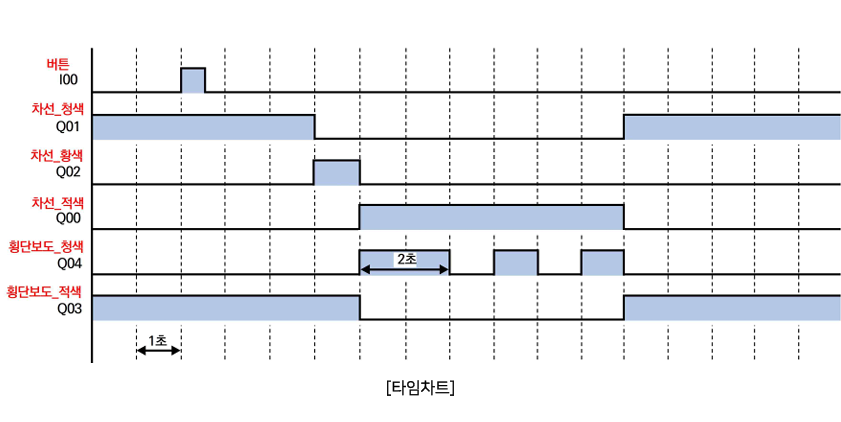
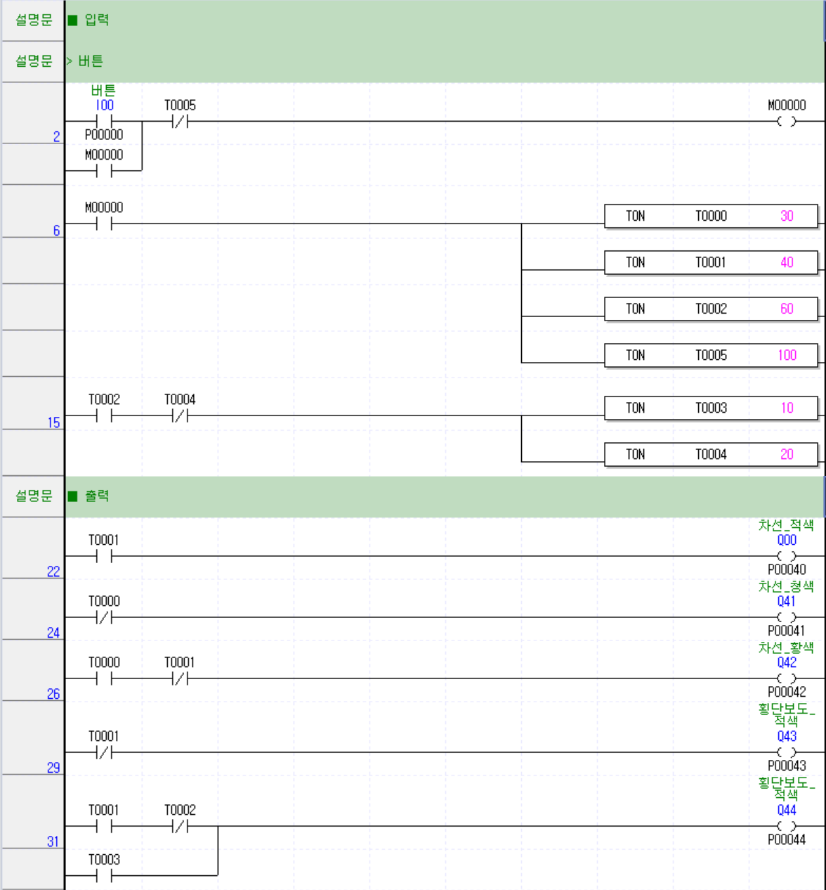
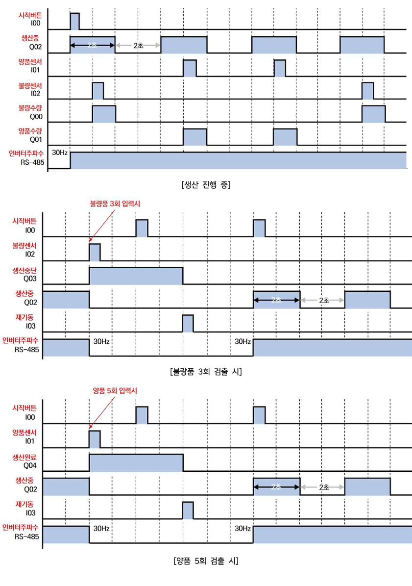
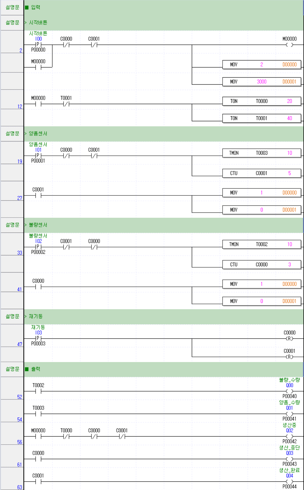

# PLC 제어기술자 3급 A형
- [제2과제 신호회로](#제2과제-신호회로)
  - [타임차트](#타임차트)
  - [래더도](#래더도)
- [제3과제 생산공정](#제3과제-생산공정)
  - [타임차트](#타임차트-1)
  - [래더도](#래더도-1)

---

## 제2과제 신호회로

### 타임차트

### 래더도

---

## 제3과제 생산공정

### 타임차트

### 래더도

