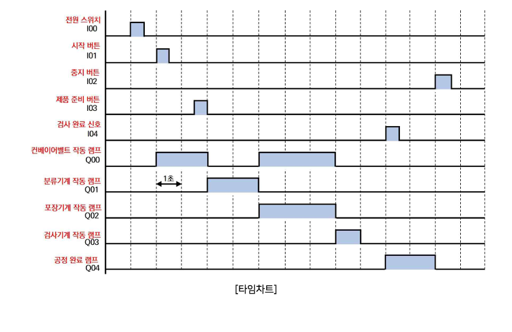
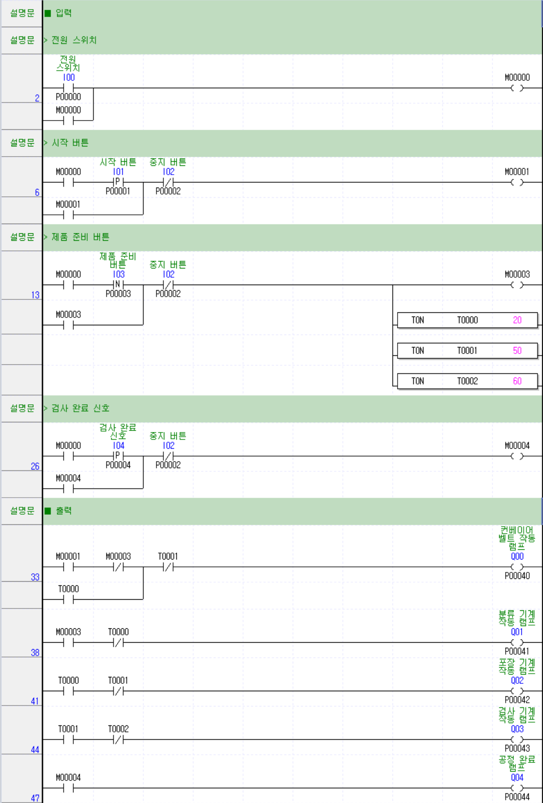
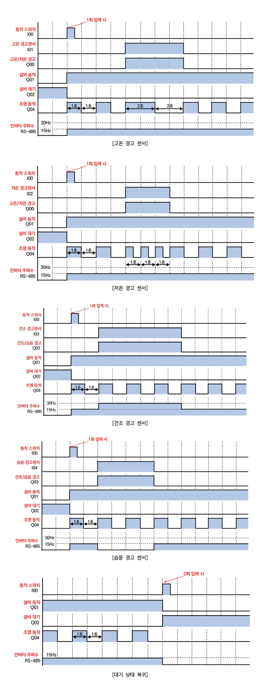
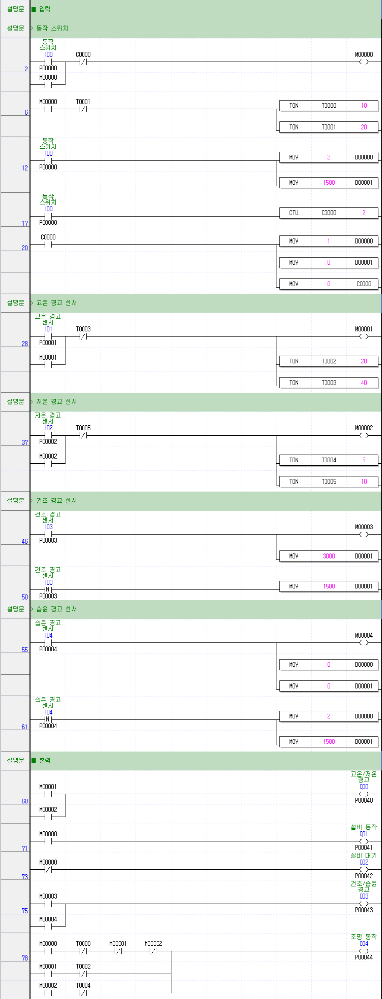

# PLC 제어기술자 3급 B형
- [제2과제 공정신호제어](#제2과제-공정신호제어)
  - [타임차트](#타임차트)
  - [래더도](#래더도)
- [제3과제 스마트팜 설비제어](#제3과제-스마트팜-설비제어)
  - [타임차트](#타임차트-1)
  - [래더도](#래더도-1)

---

## 제2과제 공정신호제어

### 타임차트

### 래더도

---

## 제3과제 스마트팜 설비제어

### 타임차트

### 래더도
