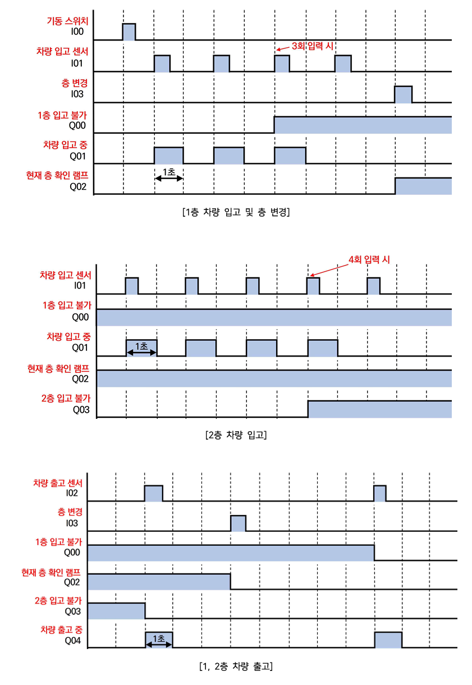
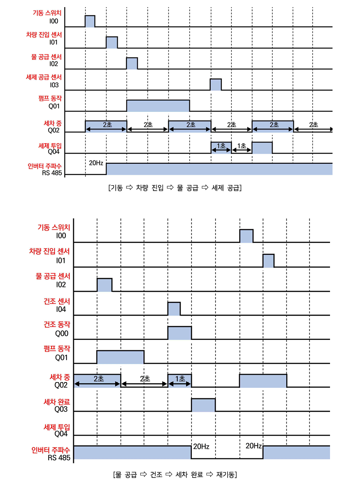
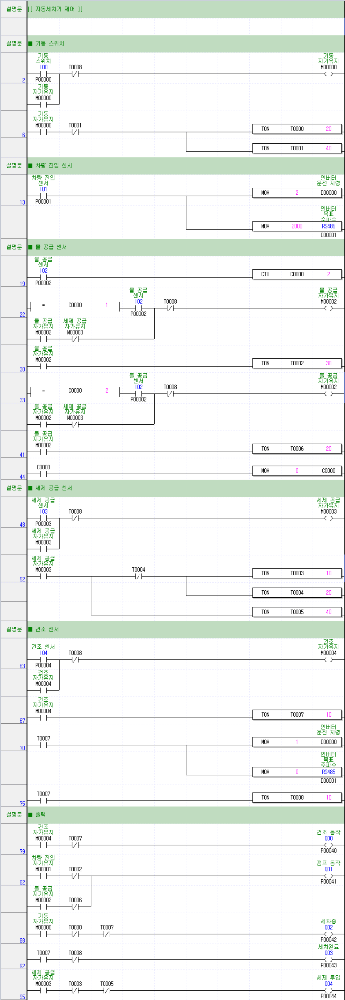

# PLC 제어기술자 3급 C형
- [제2과제 주차타워제어](#제2과제-주차타워제어)
  - [타임차트](#타임차트)
  - [래더도](#래더도)
- [제3과제 자동세차기 제어회로](#제3과제-자동세차기-제어회로)
  - [타임차트](#타임차트-1)
  - [래더도](#래더도-1)

---

## 제2과제 주차타워제어

### 타임차트

### 래더도
> 학습 진행중

---

## 제3과제 자동세차기 제어회로

### 타임차트

### 래더도

