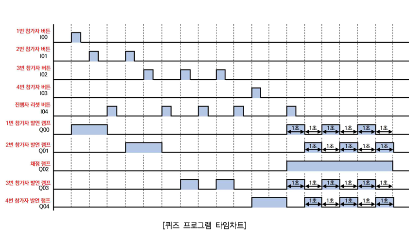
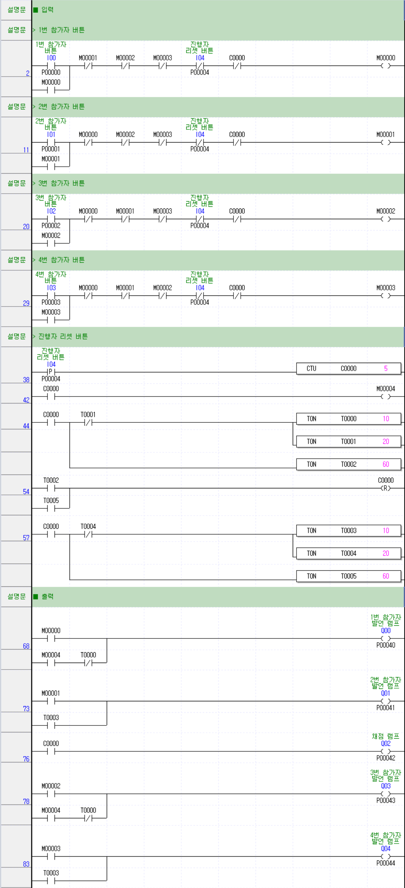
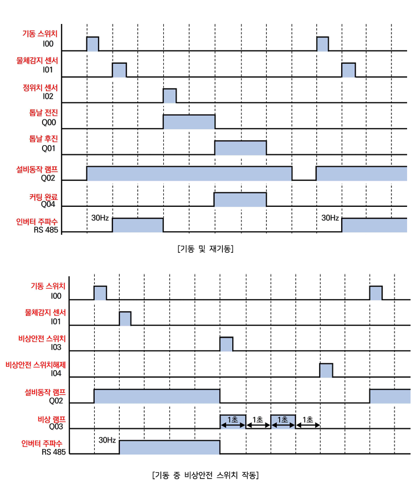
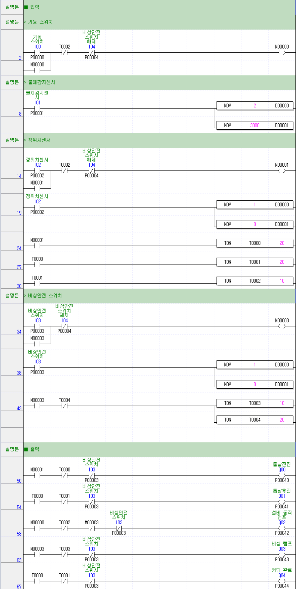

# PLC 제어기술자 3급 D형
- [제2과제 퀴즈 프로그램제어](#제2과제-퀴즈-프로그램제어)
  - [타임차트](#타임차트)
  - [래더도](#래더도)
- [제3과제 절단기제어](#제3과제-절단기제어)
  - [타임차트](#타임차트-1)
  - [래더도](#래더도-1)

---

## 제2과제 퀴즈 프로그램제어

### 타임차트

### 래더도

---

## 제3과제 절단기제어

### 타임차트

### 래더도
