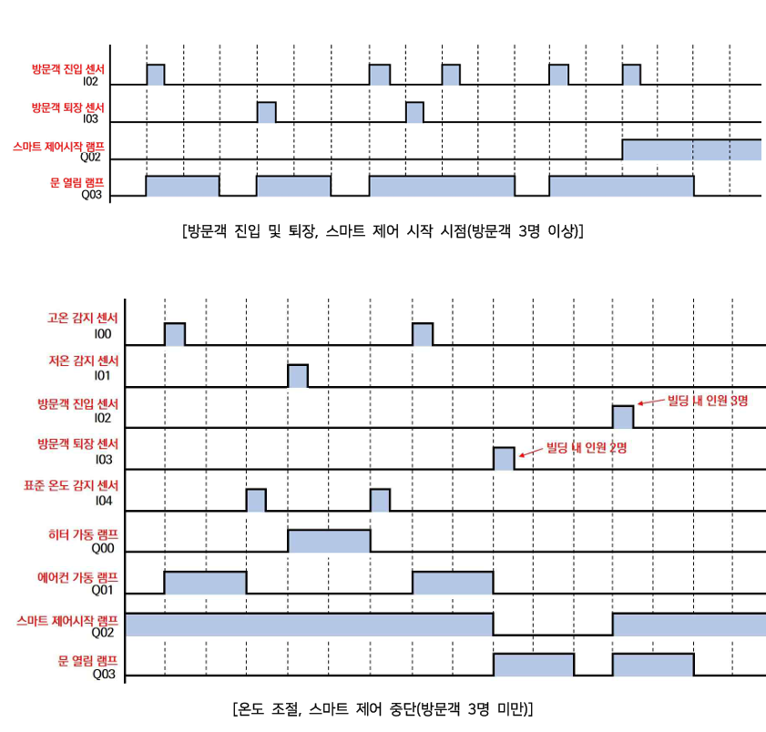
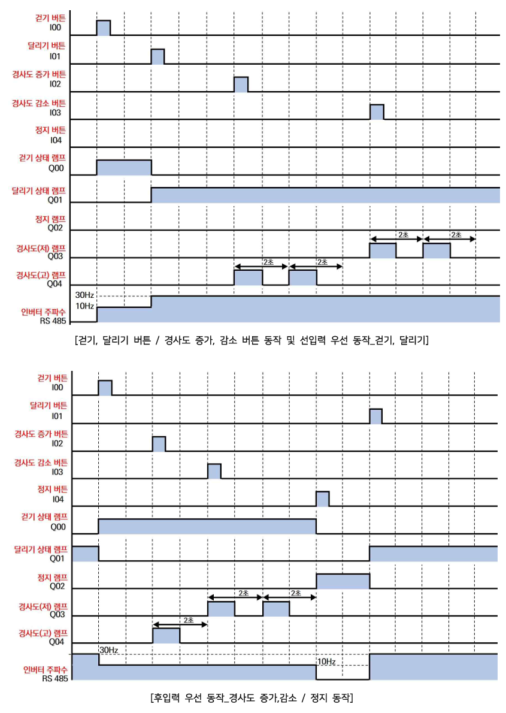
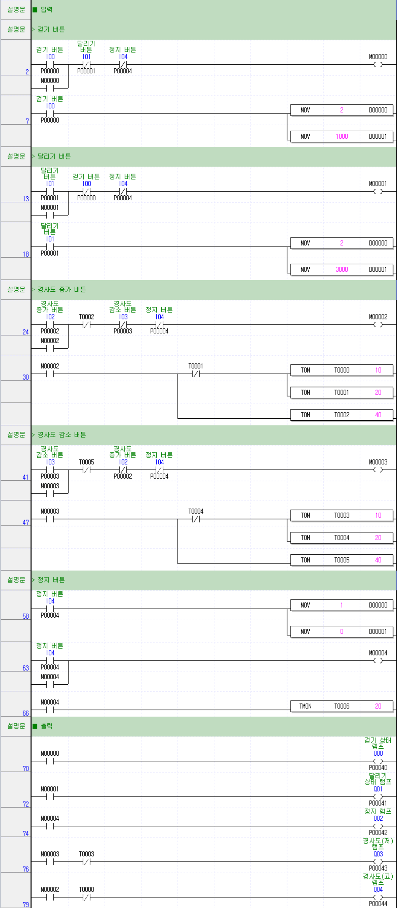

# PLC 제어기술자 3급 E형
- [제2과제 스마트빌딩제어](#제2과제-스마트빌딩제어)
  - [타임차트](#타임차트)
  - [래더도](#래더도)
- [제3과제 러닝머신제어](#제3과제-러닝머신제어)
  - [타임차트](#타임차트-1)
  - [래더도](#래더도-1)

---

## 제2과제 스마트빌딩제어

### 타임차트

### 래더도

---

## 제3과제 러닝머신제어

### 타임차트

### 래더도
